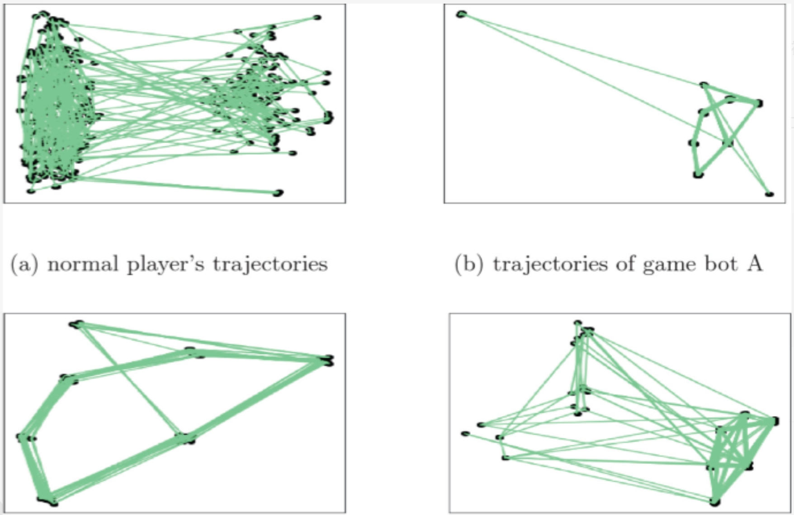
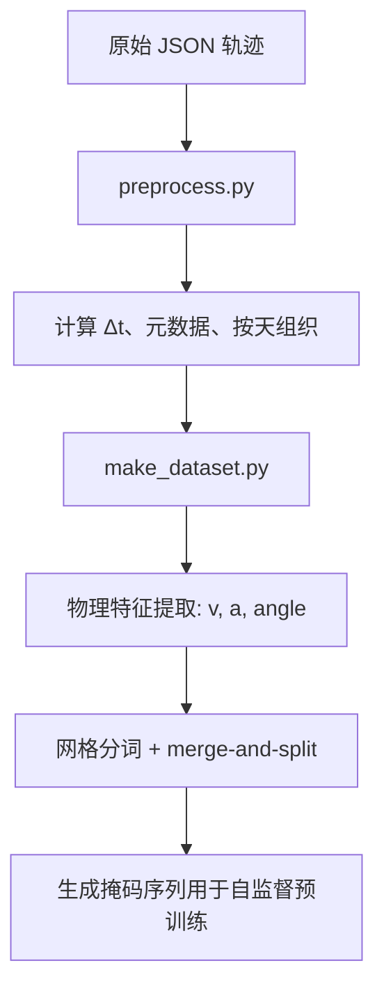
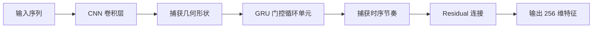
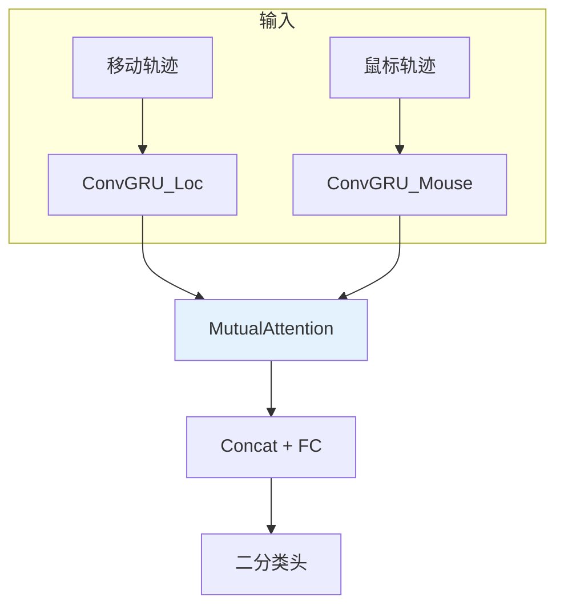
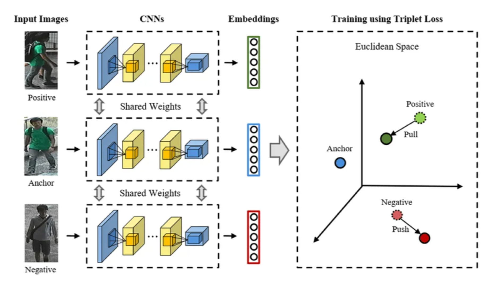
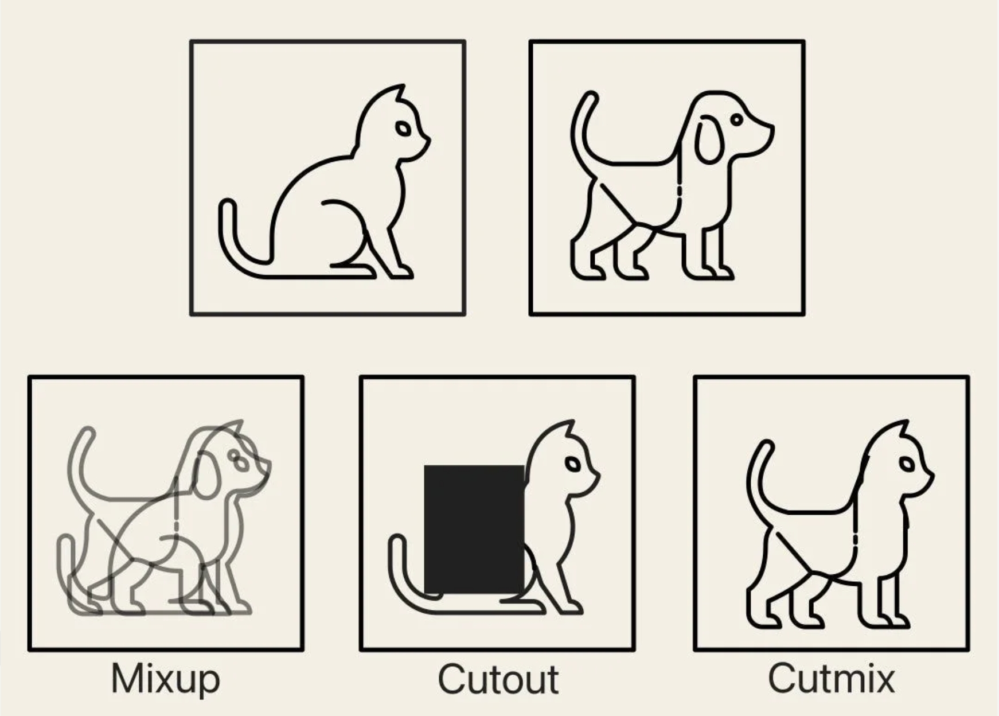

# T-Detector 技术解析
**基于轨迹的 MMORPG 外挂检测预训练模型**

**williammuji**


---

## 第 1 页 - 议程

- 项目背景
- 数据采集
- merge-and-split 动态网格算法
- LocationTime2Vec 时空感知嵌入
- ConvGRU 混合编码器
- Mutual Attention 双流融合机制
- FusionModel 整体架构与前向流程
- Triplet Loss 在嵌入优化中的作用
- 预训练 → 下游微调完整训练路径
- 数据增强策略（Mixup & Cutmix）
- 端到端执行脚本 run.sh
- 实时部署方案与工程实践
- 自动化测试体系
- 论文核心创新点总结

---

## 第 2 页 - 项目背景

**问题场景**
老端游中，外挂有挂机、锁敌、跟随、宏操作，传统规则/签名检测极易被绕过。

**T-Detector 核心思路**
将玩家**移动轨迹**与**鼠标轨迹**作为主要信号，构建行为指纹，实现端到端自监督预训练 + 下游二分类检测。

**核心优势**
- 少量标注数据即可达到高精度
- 对新型未知外挂具有较强泛化能力
- 可解释性强（UMAP 行为雷达图）

---

## 第 2 页 - 项目背景



---

## 第 3 页 - 数据采集

**采集内容**
- 位置序列：`(x, y, timestamp)`
- 鼠标序列：`(mx, my, timestamp)`

**采集方式**
- 触发式采集：仅在进入战斗、选中目标、施放技能时启动 Session
- Session 时长：30~60 秒或直到玩家闲置 >10s
- 过滤策略：少于 N 个移动 tick 或 M 个动作事件则丢弃


---

## 第 4 页 - 预处理流水线



- preprocess.py：基础清洗与元数据构建
- make_dataset.py：特征工程与掩码生成

---

##  第 5 页 - merge-and-split

动态网格算法设计目标：解决地图密度不均衡问题算法流程：初始化粗粒度网格（e.g. 100×100）

- 统计每个网格内轨迹点密度
- 高密度网格（> H）执行四叉树式分裂
- 低密度相邻网格（< L）执行合并
- 迭代直到全局密度方差低于阈值

```python
while not converged:
    for cell in grid:
        if density(cell) > HIGH_THRESHOLD:
            split_cell_into_4(cell)
        elif can_merge_with_neighbors(cell):
            merge_cells(cell, neighbors)
```

效果：热门区域获得更高分辨率，稀疏区域减少无效 Token，提升嵌入质量。

---

## 第 6 页 - LocationTime2Vec

时空感知嵌入改进点（相对于标准 Word2Vec）：
- 显式建模时间距离 Δt 与物理距离 dist
- 上下文向量加权：context = base_vec * exp(-Δt/τ) * exp(-dist/σ)
- 融合类别元数据（MapID、Weekday、TimeOfDay）

训练流程：
- time_dis_w2v_preprocess.py 生成带时间/距离标签的序列
- time_dis_w2v.py 使用自定义 Skip-Gram 训练

意义：
- 使嵌入向量天然携带时空语义，显著提升对机器人规律性轨迹的敏感度。

---

## 第 7 页 - ConvGRU

混合编码器模块组成：



各组件作用：
- CNN：提取局部几何模式（直线、圆弧、锯齿）
- GRU：建模长程时间不连续性（人类疲劳停顿、突发加速）
- Residual：防止深层网络丢失原始位移信息

---

## 第 8 页 - Mutual Attention

双流融合机制核心思想：
- 让移动特征与鼠标特征互相查询、互相增强。

前向过程：
- Loc → Query，Mouse → Key/Value → Loc_enhanced
- Mouse → Query，Loc → Key/Value → Mouse_enhanced
- 融合：fused = out_proj(Loc_enhanced + Mouse_enhanced) + residual

作用：
- 显式建模“移动-鼠标”过度同步特性，是区分高级外挂的关键信号。

---

## 第 9 页 - FusionModel



- 前向传播完整流程：两条 ConvGRU 并行编码
- Mutual Attention 双向增强
- 全局池化 + 全连接层
- 输出 logits（人类 / 外挂）

---

## 第 10 页 - Triplet Loss

嵌入优化目标：
- 在嵌入空间中实现同类拉近、异类推远。

损失定义：
```python
loss = max(0, ||f(a) - f(p)|| - ||f(a) - f(n)|| + margin)
```

- 训练策略：In-batch Hard Negative Mining 与 CrossEntropy Loss 联合训练（λ ≈ 0.2~0.5）
- 显著改善 UMAP 聚类紧致度与类间分离度

## 第 10 页 - Triplet Loss



---

## 第 11 页 - 数据增强策略

Mixup：
- mixed = λ·x₁ + (1-λ)·x₂  (λ ~ Uniform(0,1))
- 软标签：y_mixed = λ·y₁ + (1-λ)·y₂

Cutmix：
- 在序列维度随机切割一段，用另一样本对应片段替换，保留原标签比例

实现位置：
- trainer.py 中 forward 前以概率 0.5 应用，显著提升模型对噪声和边界样本的鲁棒性。

---

## 第 11 页 - 数据增强策略



---

## 第 12 页 - 端到端训练流水线

run.sh


执行顺序严格依赖，前一步输出作为后一步输入。

---

## 第 13 页 - 实时部署架构

推荐技术栈：模型导出：TorchScript / ONNX + TensorRT 量化

- 服务端：FastAPI + Redis 缓存嵌入向量
- 数据流：Kafka + 触发式采集
- 推理延迟目标：< 500ms（GPU） / < 1s（CPU）
- 部署形态：云端推理服务 + 游戏客户端轻量插件
- 支持在线增量微调（联邦学习可选）

---

## 第 14 页 - 自动化测试体系

核心测试文件：
- test_entropy_module.py：验证人类高熵 vs 宏低熵 + FFT 尖峰检测
- test_aim_correlation.py：验证跟随机器人相关系数 > 0.98 且动作抖动 < 5ms

采用 unittest 框架，集成到 CI/CD 流水线，确保每次重构后核心指标不退化。

---

## 第 15 页 - 论文核心创新点

- 首个针对 MMORPG 的轨迹预训练框架
- LocationTime2Vec：显式时空距离感知嵌入
- ConvGRU + Mutual Attention 双流融合模型
- Angle-based 自监督预训练 + Triplet Loss 嵌入优化

---

## 第 16 页 - 总结

T-Detector 技术精髓：
通过轨迹建模 + 自监督预训练 + 双流互注意力，实现了对高级行为外挂的高精度、可解释检测。未来方向：多模态融合（键盘节奏 + 技能序列）
在线持续学习
轻量化部署至客户端

